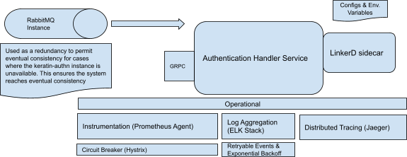
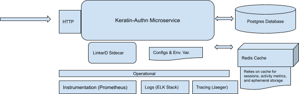
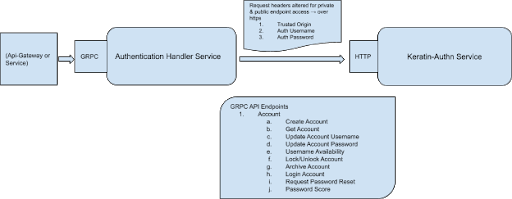

__Simifinii: Authentication Microservice Design Document__

__Date__: 2021-11-05

__Project__: Simifinii: Authentication Microservice

__Audience__: Engineering

__Authors__: Srikar, Yoan Yomba

__Emails__: yoanyombapro@gmail.com

__Reply To__: yoanyombapro@gmail.com

## Introduction
The primary goal of this service is to serve as the primary means of authentication within the backend system.

## Motivation
Authentication is an extremely important aspect of an any platform due in part to the fact that data protection at the user level must be enforced as well as access level permissions. Authentication however, in a distributed system provides more complexities. In monolithic applications, authentication and authorization can be performed via sessions. However, in a distributed system, since multiple instances of a service can be deployed at one time, enforcing user requests to the originating session instance (sticky sessions) isn’t viable and introduces a ton of operational overhead.

With this in mind, we at the simifinii aim to implement our authorization scheme via 2 sets of services via json web tokens (JWT). We also make use of a distributed cache for session storage which ensures that we don’t need to maintain stickiness across instances of a server. The authentication framework developed by us consists of 2 service instances. One is a stateful instance which utilizes the open-sourced keratin-authn microservice and interfaces with either a postgres or mysql database.The second instance is a headless authentication service which is stateless and serves as an interface through which the keratin-authn service can be interacted with.

The rest of this design document provides further details pertinent to this implementation.

## Potential Solutions
Proposed above is a solution that utilizes 2 sets of services. One which serves as a stateless headless service and interacts with the keratin authn stateful service via APIs. The reason for this design decision is to first abstract the private and public api’s keratin authn exposes from the context of other consuming services. Without this, all calling services would have to be aware of public and private endpoints as well as properly set headers. Through the headless authentication service, these can automatically be set in requests prior to transit.

The reason we picked the open sourced keratin authn service was partly due to the fact that we needed the service to completely own all account credential data completely removing this necessity from other microservices. Additionally we loved its reliance on SQL databases for long term account/credentials data, and its ease of integration into our backend system.

In summary, the API that the authentication handler service provides and its ability to interface with keratin-authn eases the operational overhead all consuming services must absorb.

### (EXPERIMENTAL : Implement After MVP Launch)
It is important to note one very important point. The headless authentication service withholds a go-routine which continuously polls the message queue’s “record update” channel. The messages in such queues follow the following rubric. They must contain the name of the respective grpc api and the required request field parameters. The go-routine routinely polls the message queue, performs the operation defined by the message via a set of retries and on failures (internal server error) … puts the message back onto the queue.

## Assumptions
No assumptions are currently present. However, this section is prone to change especially as the service level requirements change.

## Constraints/Limitations
These sets of services are only meant to provide an authentication mechanism and retain a single source of truth of the state of an account throughout the backend system. Account state updates must propagate to this service via distributed transactions. Consistency holds the highest priority when dealing with account record state within the system.
System Design/Architecture
System Diagram & Flowchart

__Figure 1: Authentication Handler Service__

__Figure 2: Authentication Service (Keratin Authn)__

__Figure 3: Service Level Interactions__

## Hard & Soft Requirements
This is a crucial part of the system. As a result, if either instance goes down, users will inherently be unable to sign into the system, create new accounts, and account records could be in an inconsistent state across the backend. In summary, this would cause an outage.

Since consistency is key to ensuring the system behaves as expected, we must build in resiliency through asynchronous messaging in hopes of enabling failed requests to eventually be processed (eventual consistency). This concept of eventual consistency if truly only relevant for failed requests attempting to modify account record states. In cases of failed sign up/sign in requests due to service unavailability, we must provide the proper alert logic (sev 1 … etc) so that the on-call can fix the problem at hand.

It is important to note that we prioritize data consistency across the backend since lack thereof can have serious implications. Lack of access to the system as a result of complete failure for us although ill-advised can be rectified assuming the on-call tends to the failure in a timely manner. This however entails that granular logs are emitted, the proper set of metrics are defined, critical logic paths are instrumented, and proper monitoring is set in place.

Remember, there is no such thing as “over instrumentation”.

## Algorithm & Pseudocode For Main Components
### Authentication
The authentication scheme makes use of JWT tokens for authentication. In order for a user to be properly authenticated, he/she must first create an account then go through the account sign up flow. From the context of the frontend, the registration flow varies across user types. However, in the context of the backend, all accounts have similar registration flow and exact sign up flow.

### Registration
Registration is a multi-step process that begins at the client and involves a multitude of services. The below step outline this process
* Through a form on the frontend, we collect a user’s credentials and other required pieces of data & perform field validation
* Send the request to the Api-Gateway
	* Api-Gateway obtains from the request object the email and password fields and performs a series of calls to the headless authentication
  service. The first endpoint called is the “password score” to ensure the request password is strong enough.
		* On failure, we return an error to the client stating the provided password is too weak.
		* On success, we proceed to the next call
	* Api-Gateway invokes the “create account” api of the authentication handler service.
		* Headless Authentication service performs a create account call via the authentication service and returns the id of the created account to
	  the Api-Gateway.
		* On failure, we return an error to the client stating that the provided credentials are invalid or there is an outage.
		* On success, we perform the next set of operations
	* With the returned ID, the Api-Gateway calls a set of backend services explicitly or through msg queues to create records from their context
		  and any additional operation such as sending out email, … etc.
		* If this fails, the gateway needs to be smart about retrying this operation. ensuring fields are properly validated before the request is
	  sent from the frontend to the gateway can limit this from happening.
		* NOTE: these set of operations should be performed asynchronously via messages and a queue
	* Upon successful creation of the account, we send the successful response to the frontend

The only difference between the set of service level interactions in the backend between merchant and shopper registration is the manner in which services interact upon a successful response is obtained from the authentication handler service after the “create account” call.

### Login
When a user logs in, they establish two sessions: one with the frontend which expires periodically, and another with the backend that can be used to refresh the app session. These are called the access token and refresh token, respectively.

During login, the backend works to ensure that users may not enumerate users in your system. This means it will not declare which field was incorrect , but instead fails with a generic credentials error. The below set of steps outline the process by which this logic flow is carried out.
* Through a form in the frontend, we collect user credentials and validate all fields
* Send the information to the Api-Gateway
	* Api-Gateway calls the authentication handler service via the “login” grpc endpoint which calls the authentication service to ensure it
  withholds the record of interest
		* On failure, we return an error to the frontend immediately
		* On success, we obtain a JWT token and perform the following set of operations
	* We condition on account type and call a set of backend services to create a response that is
		  necessary for the ensuing UI page that follows successful logins
		* NOTE: Because we will be calling numerous services and schema stitch their responses, we are ok with partial failures. However, we must
	  ensure we provide the proper retry logic in place in cases of failure and emit the right set of metrics.
		* On failure of all calls, we should raise a sev 1 incident and return an error to the client
		* On success, we return the data to the frontend.
	* Frontend obtains positive response from Api-Gateway and stores the JWT token in the browser cache which it can leverage on ensuing requests
		  by placing the token in the request header

### Logout
Most of our users will probably disappear when they close the application, but sometimes they will want to cleanly log out. The backend will take care of cleaning up its sessions (the access token and refresh token). The below set of steps outline out log out flow.
* The Api-Gateway is called with the current user’s account id when a user clicks the logout button.
* Api-Gateway by use of the account ID calls the headless authentication service via the “logout” grpc endpoint which invoked the “logout” http
  endpoint of the keratin-authn microservice.
	* On success, the token within the session established with the backend for the account is revoked and the session is terminated.
	* On failure, we emit metrics, and continue to the next set of calls
* Api-Gateway call any other cleanup operations against the APIs of other microservices
	* NOTE: perform this via message queues. Asynchronous operation is useful in this scenario
* Api-Gateway returns a success response to the frontend
* Frontend removes the JWT token from browser cache.

### Password Reset/Change
The password registration process is a 2 phased endeavor. It requires the account owner to first request a password which will result in the account owner obtaining an email with a link to a password reset page where the password will be reset
* Through a form on the frontend, a user will provide their email field which will be validated prior to the Api-Gateway being invoked
* Api-Gateway obtains the email field from the request body and call the headless authentication service via the “password reset” grpc endpoint
	* Headless Authentication service invokes the “/password/reset” http endpoint of the authentication service.
		* Authentication service will post a webhook to the application password reset url with a request body containing the account ID and the
	  generated jwt token.
			* NOTE: This webhook should be the url of the email service which would send an email containing the data to the user’s email and a
		  link to a custom password reset form. APP_PASSWORD_RESET_URL environment variable must be set
		* Authentication service will return a response code which will tell the Api-Gateway whether an error occurred or not.
	* Response code is used to send message to the frontend

In the second phase, once the user obtains the password reset email and clicks on the link forwarding him/her to the password reset form, we perform the following set of operations.
* Through the frontend, the user inputs his/her new password. Fields are validated and then a request is sent to the Api-Gateway. Prior to the
request being sent, the JWT token which was sent to the user’s email is attached to the request header
* Api-Gateway calls the authentication handler service’s “password score” grpc endpoint first.
	* On failure, re-prompt the user to input a stronger password
	* On success, perform the next set of operations
* Api-Gateway invokes “update account password” grpc endpoint which calls the authentication service via “/password” http endpoint with the new
	  password and the JWT token.
	* On failure, return the error message to the client
	* On success, perform the next set of operations
* Api-Gateway calls and updates other dependent services that must be aware of the new password such as sending a confirmation email that the
	  password was successfully changed, … etc and returns the status of the prior operation to the frontend.
	* NOTE: these set of service level interactions should ideally be performed via message queue.

### Record Update
Account record modifications are expected and must occur in a fault-tolerant manner. The below set of steps outline the steps set in place in order to mitigate inconsistencies throughout the backend on operation failures especially since the state of the record present in the authentication service (keratin-authn) is the single source of truth.

#### Operations
Any operation which updates the state of an account record (lock/unlock, update, archive,...etc) may fail and as a result we must ensure the proper limitations are set in place.

Whenever a record state update is attempted through the invocation of a respective grpc endpoint, the calling service must first perform the call and check the response. The following options are available to the caller depending on the status of the operation
* Failure
	* On failure (after numerous retries and internal server error), the calling service has 2 choices.
		* Either the calling service fails the current overarching operation entirely
		* In cases when eventual consistency is acceptable, the calling service can place a message on the “update channel” of the message queue
		  which the authentication handler service is subscribed to and is to handle at some point later on.

## SLA & Service Guarantees
Fault tolerance and recovery requirements are defined above.

## Data Definition, Schema Design, Persistence Requirements
The data model is currently very simple. The authentication service (keratin-authn) only stores the following fields
* Record ID
* Username/Email
* Password
* Locked (Tells whether the account is locked)
* Deleted (Tells whether the account has been archived)

## Caching Requirements
Currently, there are no caching requirements as the headless authentication service is stateless and the authentication handler service only makes use of a key value store for session storage.

## Capacity Planning
Both services will generate logs, metrics, and traces. However, there isn’t an expectation that the service will generate an abnormal amount of data. We will leverage datadog as our metrics, log, and trace store. The retention policy will be 1 month.

## Performance Requirements
Authentication Handler Service & Authentication Service (keratin-authn)
* Expected throughput: 50K QPS
* Expected Latencies: < 9ms

In order to ensure we have the utmost throughput and the minimal service level latencies, we following points must be enforced throughout development.
A gRPC channel must be reused when making gRPC calls since this allows calls to be multiplexed through an existing HTTP/2 connection. If a new channel is created for each gRPC call then we can have a significant latency overhead since each call will require multiple round trips between the client and the server to create the HTTP/2 connection:
* Opening a socket
* Establishing TCP connection
* Negotiating TLS
* Starting HTTP/2 Connection
* Making The gRPC call.

Channels on the contrary are safe to share and reuse between gRPC calls since gRPC clients are created with channels, are lightweight and don't require much caching. Multiple gRPC clients can be generated from a channel and such channels and clients can be used by multiple threads.

Please reference grpc performance best practices throughout development to optimize performance.

## Security
The authentication scheme makes use of emails which is considered personally identifiable information (PII/PCI). As a result, security is crucial. The proper origin headers must be set which is enforced by the keratin-authn service as well as communication via https. To further enhance security, all API traffic must be encrypted with TLS and SSL internally.

Please reference security best practices throughout development to better secure the backend system.

##Multi Region Story
As of yet, there are no regional special requirements for this service.

## API/gRPC Endpoints
Please reference the grpc endpoint documentation throughout development.

## Rollout Plan
### Rollout Phases
Rollout phases will be determined later.
A/B Tests
A/B Tests will be determined later.
### Data Migration
No data migration should occur however in the context of the authentication service, schema migrations should occur.

## Test Plan
Testing is crucial and will be prioritized throughout development. Unit tests will be of high importance. We mandata that each service has at least 85% unit test coverage. As for testing dependencies through integration and load tests, we will perform this in four phases.
* Phase 1: mock dependency response & test logic
* Phase 2: spin up dependencies in docker containers & perform gCurl against grpc endpoints & ensure expected response is obtained
* Phase 3: spin up dependencies in local & sandboxed kubernetes cluster & perform gCurl against grpc endpoints & ensure expected response is obtained.
* Phase 4: through use of vegeta load testing tool we will perform load tests against services running in kubernetes sandbox environment

The final stage of testing will apply chaos testing. We will enable certain environment variables which will fail some requests based on some preset probability. With this, we will perform load tests once again and ensure the proper set of metrics are emitted and the service is behaving as expected.

__NOTE__: it is important all these can be performed both locally and within our CI/CD workflow.

## Appendix
SSL & TLS Examples

## Review Sign-Off
Team Lead/Manager - sign off by Srikar, Yoan Yomba
Sponsor - sign off by Yoan Yomba

