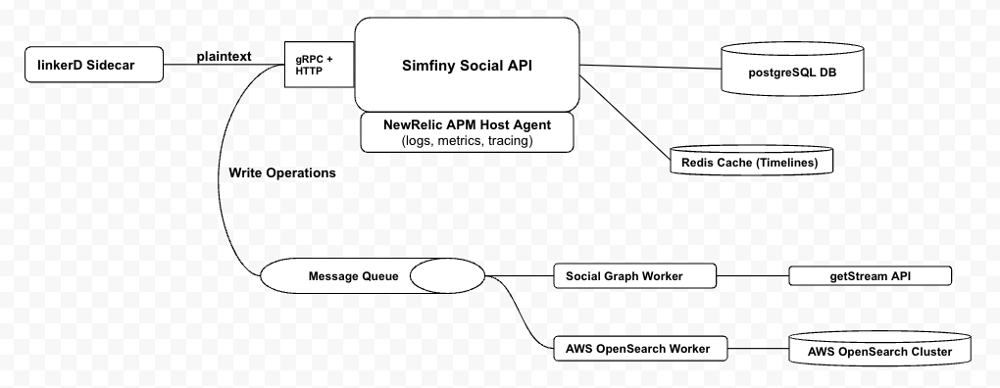
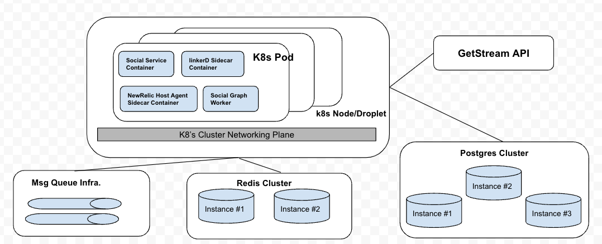
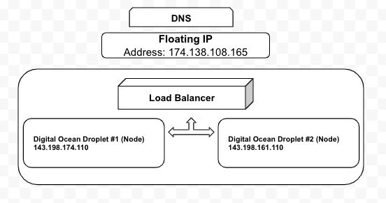
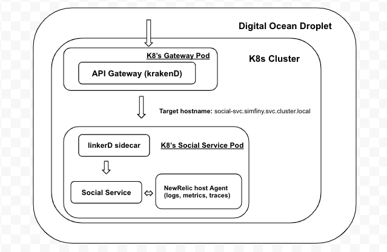
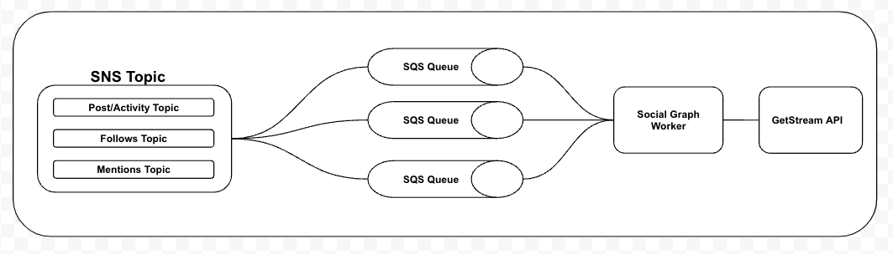

# RFC: Social Service Design Document

Owner: D Yoan L Mekontchou Yomba

**********References**********

**Date:** 2022-07-28

**Project:** Social Service Design Development

**Audience:** Engineering

**Authors:** Yoan Yomba

**Emails:** yoan@simfinii.com, srikar@simfinii.com, sean@simifinii.com

**Reply To:** yoan@simfinii.com, srikar@simfinii.com, sean@simifinii.com

## Introduction

The primary goal of the Social Service is to provide an interface by which api consumers can interact with all social facets of the Solomon-AI platform. This service (leveraging the GetStream API) will serve as a single source of truth for all social features built on Solomon-AI.

## Motivation

Solomon-AI provides a medium by which numerous stakeholders can not only track the health of their finances, but leverage their peers and our various offerings to achieve all conceivable financial goals they may withhold. 

Given financial habits are emotion-based and highly influenced by group dynamics; we believe a social experience is pivotal for our end-users. Social experiences although hard and incredibly complex (think of instagram, tiktok, linkedIn, …etc) are extremely useful when attempting to generate re-affirming feedback loops especially around emotion-based behaviors. With this in mind, we at Solomon-AI have concluded that properly defining a social experience for our end-users and adequately architecting a backend that can support this initiative is critical for us to provide the value we believe our users need. 

The social service will serve as the core service driving all features tied to digital social experiences on the Solomon-AI platform. 

This technical design document provides granular details specific to service level interactions, dependencies, monitoring, …etc. The aim here is to provide as much detail as possible in hopes of easing the onboarding process of any future developer and effectively providing a reference to be utilized throughout development.  

## Potential Solutions

### **Singular service**

**Features encompass**

1. Profiles (follow/**unfollow (Not Yet Supported)**/block profiles, search profiles, get/create/update/delete profile)
2. Posts (create(own TL, target TL, community TL)/delete/like/unlike/comment/share(own, target, community TL)/mention profiles in/mention communities in posts)
    1. Posts in Communities (Group (by hashtags | tags | topics))
3. Communities(subscribe/**unsubscribe (Not Yet Supported)**, search community, view community)
4. Topics(create/update/delete topic in community (based off hashtag), view topics, view posts associated with topics)
5. Notifications (based on mentions, TL interactions, …etc)

### Datastore

**PostgreSQL Database**

This service exposes a set of gRPC endpoints through which API consumers can interact with the data it presides over. gRPC was picked as the communication protocol of choice for many reasons defined below.

1. gRPC uses HTTP/2 which allows support for highly performant and scalable APIs making use of binary data
2. More compact and efficient communication scheme through binary payload
3. Easier to generate client side gRPC libraries
4. Low latencies, especially beneficial to us as we ensure the service meets strict SLA requirements.

PostgreSQL is the database of choice for this service. We decided to use this database due in part to its extensibility. Postgres allows us to define our own types, build custom function aligned with our business needs, and abide by many of the features required by the SQL standard. Below are further reasons we chose to select this database as our main storage component.

1. Common & Custom Data Types (Primitive, Structured, Document, Geometry, & Customizable types)
2. Data Integrity through exclusion constraints and explicit + advisory locks
3. Concurrency & Performance
    1. Sophisticated query planner and optimizer, multi version concurrency control, read query parallelization, table partitioning, JIT compilation of expressions, sophisticated and isolated transactions
4. Reliability & Disaster Recovery
    1. Asynchronous and Synchronous replication, Write ahead logging, table spaces,...etc
5. Robust access control system, Column + Row Level security
6. Extensibility
    1. Stored functions & procedures, customizable storage interfaces, foreign data wrappers

In summary, we believe that PostgreSQL as our storage unit and grpc as our api allow us to have the most performant service inherently elevating the quality of our end customers experience.*.*

### Cache

**Redis In-Memory Cache**

Redis is the cache solution of choice for this service and will primarily help us scale our read intensive request load. We decided to use this service due in part to its performant nature and availability. Redis provides [data structures](https://redis.io/docs/data-types/) such as [strings](https://redis.io/docs/data-types/strings/), [hashes](https://redis.io/docs/data-types/hashes/)
, [lists](https://redis.io/docs/data-types/lists/), [sets](https://redis.io/docs/data-types/lists/), [sorted sets](https://redis.io/docs/data-types/sorted-sets/) with range queries, [bitmaps](https://redis.io/docs/data-types/bitmaps/), [hyperloglogs](https://redis.io/docs/data-types/hyperloglogs/), [geospatial indexes](https://redis.io/docs/data-types/geospatial/), and [streams](https://redis.io/docs/data-types/streams/). Redis has built-in [replication](https://redis.io/topics/replication), [Lua scripting](https://redis.io/commands/eval), [LRU eviction](https://redis.io/topics/lru-cache), [transactions](https://redis.io/topics/transactions)
, and different levels of [on-disk persistence](https://redis.io/topics/persistence), and provides high availability via [Redis Sentinel](https://redis.io/topics/sentinel)
 and automatic partitioning with [Redis Cluster](https://redis.io/topics/cluster-tutorial). Atomic operation can be performed on the above mentioned types; some of which include:

1. Appending to a string
2. Increment a value in a hash
3. Pushing an element to a list
4. Computing set intersection, union, or difference
5. Getting the member with the higher ranking in a sorted set

To achieve top performance, Redis works with an **in-memory dataset**. Depending on the provided use case, Redis can persist data either by periodically [dumping the dataset to disk](https://redis.io/topics/persistence#snapshotting) or by [appending each command to a disk-based log](https://redis.io/topics/persistence#append-only-file). 

Lastly, Redis supports [asynchronous replication](https://redis.io/topics/replication), with fast non-blocking synchronization and auto-reconnection with partial resynchronization on net split.

In summary, we believe that Redis as our cache layer elevates system wide performance ultimately allowing us to scale at a faster rate. 

### **Asynchronous Processing**

**Amazon SQS & SNS**

We will leverage Amazon Simple Notification Service (SNS) and Amazon Simple Queue Service (SQS) for asynchronously building the social graph via GetStream as well as sending newly created Users + FinPods to our AWS OpenSearch cluster to facilitate our search experience. 

SNS withholds pub/sub functionality which provides topics for our high-throughput, push-based, many-many messaging use case. With SNS topics, our backend can fanout messages to subscribing systems which in our case is SQS.

SQS is a fully managed message queuing service that enables us to decouple and scale our microservices. SQS eliminates the complexity and overhead associated with managing and operating message-oriented middleware, and empowers us to focus on differentiating work. Using SQS, we can send, store, and receive messages between service components at any volume, without losing messages or requiring other services to be available. 

### **Blob Store (Images + Blobs)**

**Amazon S3** 

We will leverage Amazon Simple Storage Service (S3) as an object store primarily for images uploaded by end-users. In the early phases, images stored will only be profile images, however, this is subject to change especially as we allow more and more users to post all forms of content (images, videos, … etc)

## High Level System Design & Assumptions

### Basic Requirements

At a high level, the Solomon-AI social experiences should be comprised of the following facilities:

1. Users should be able to create/interact with pieces of content. Additionally, users should be able to interact with other users and communities (finpods). They should be able to see posts, statuses and app activities from users + groups they follow
    1. Post interactions encompass the following: like, unlike, star, share, comment, mention, hashtag
    2. Posts can be text, video links, or images
2. Users should be able to subscribe to communities (finpods). **Note:** a group is an open community where one can post content only if subscribed to said community. **We should not make this more complex than necessary.** 
3. Newsfeeds will be the medium by which users interact with others on the platform. Each user will essentially have 3 newsfeeds (1 personal, 1 notification, 1 feed w/ all followed content)
4. For security and privacy concerns, users should be able to block other users

To limit the impact on our fan-out limits imposed to us by GetStream, **for now** we disallow the following behaviors on our platform

- Dis-Allow Unfollowing Users/ Groups
- Dis-Allow Updating/Removing Activities/Posts

### Design Goals

The following encompass the design goals of the Solomon-AI social

1. System should be scalable to a limit of 500K DAU (Daily Active Users)
2. Users can follow up to 300 entities (communities + users)
3. Assume 1K new posts per second (writes) and 100K requests made per user when fetching Timelines each second (read) on average
4. New posts should be available to thousands of users with low latency of no more than 5 seconds
5. Up to 200 post feeds can appear on the user’s timeline

### Assumptions

No assumptions are currently present outside of those defined in the below set of estimations. However, this section is prone to change especially as the service level requirements change.

### Capacity Estimation

From the estimates defined under the design goals, we can see that while we anticipate at our maximal capabilities to serve 1K write requests each second, there are 100K read requests per second which boils down to a write:read ratio of 1:100. 

Given the social experience is read-heavy, the system will be designed with high-availability in mind. 

An eventual consistency model is a good approach in this case because it is acceptable for the users to see posts from their followers slightly delayed but availability needs to be a priority.

**Summary**

```json
500 K DAU
300 Entities (Permitted To Follow)
200 Unique Posts Per TL
```

### Traffic Estimation

**Summary**

```json
**Read:** 1 K QPS | **Write:** 100 K QPS
```

### Storage Estimation

**Database (PostgreSQL)**

(**TEXT READ**) 

For a given timeline, we assume on average a max size of 1 KB (text) for each post and 200 posts (max) appear on each user’s timeline

The system will need to allocate 200 KB storage capacity for each user’s timeline. 

```json
1 KB x 200 = 200 KB 
```

Given Solomon-AI under the proposed design will be architected to support 500K DAU, a total storage capacity of at least 100 GB of storage per day is necessary to support newsfeed for 500K users (disk based storage) (lower bound). 

To be safe, we should provision at least 5x that in case we need to store more data or usage patterns surge.

```json
200 KB x 500 K = 100 GB  → [100 GB, 500 GB)
```

A single server can accommodate our entire storage needs but to ensure high availability at the same time, we need to design an approach to scale the application across a federation of servers.

(**TEXT** **WRITE**) 

Daily, we can expect 500 MB of disk space for text to be utilized assuming each user submits 1 post per day. 

```json
1 KB x 500 K = 500 MB  
```

---

**(IMAGE WRITE)**

Since we will support image uploads as part of posts, we can estimate the average photo to be 200 KB. Given we are expecting to support 500K DAU, we can expect to provision image storage of at least 100 GB Per Day assuming 500K users post 1 photo of 200KB size per day. Obviously to be safe, we should provision more space than this (about 5x) 

```json
200 KB x 500 K = 100 GB → [100 GB, 500 GB]
```

(**IMAGE READ**)

At read time, instead of sending back the entire image, we will send a url to the CDN where the image resides, enabling the frontend to render it at read time. Assuming we have a maximal URL comprised of 100 characters each of 1 byte

```json
100 Bytes Per URL x 200 Posts In TL x 500 K  → [10 GB, 50 GB) 
```

We need 10GB of storage per day for links in the maximal case

### Bandwidth Estimation

```json
Seconds in days = 100K approximate seconds
**Writes |** 500 MB per day (text) + 100 GB (images)/ 100K seconds =  1005000 → 1MB per second
**Reads |** 100 GB (timeline [text]) / 100K seconds = 1 000 000 → 1 MB per second
```

### Memory Estimation

One important point to make note of is the fact that we will cache generated news feed with a TTL of 15-30 minutes per user. Hence, given a singular feed encompasses 200KB of space, and with 500 K DAU, in the most extreme case, assuming we have a timeline in cache for every single user, we will need at least 100GB of storage space (ram) for our cache. 

```json
200 KB x 500 K = 100 GB  → (100 GB, 500 GB)
```

We can reduce this requirement by ensuring only **currently** logged in users have timelines cached. Additionally, we can compress the json blob (timeline) to save on space. 

Although, one machine can store all this, to adhere to our high availability requirements, we need to scale the cache service across a federation of servers hence, a cluster of cache server instances will be ideal for this use case.

## Constraints/Limitations

According to the CAP theorem it is not possible for a distributed system to provide more than two of the following guarantees simultaneously.

- Consistency: Consistency implies that every read receives the most recent write or errors out
- Availability: Availability implies that every request receives a response. It is not guaranteed that the response contains the most recent write or data.
- Partition tolerance: Partition tolerance refers to the tolerance of a storage system to failure of a network partition. Even if some of the messages are dropped or delayed the system continues to operate.

CAP theorem implies that when using a network partition, with the inherent risk of partition failure, one has to choose between consistency and availability and both cannot be guaranteed at the same time.

High availability is a priority for social applications and to this objective, the social service chooses availability and partition tolerance from the CAP guarantees compromising on data consistency to some extent. We are comfortable with eventual consistency and these ideals are defined in our architecture and service level interactions.

To enforce this notion of eventual consistency, all write requests should be performed with the proper set of retries upon encountered failures. Additionally, a granular set of metrics should be emitted for all operations on the write path. Sensitive alerting should be present on all critical API paths or paths involved in any distributed transaction comprised of numerous state changes across more than 1 service. **** All reads/writes on the contrary are performed via the gRPC api invocation. Lastly, this service's load patterns will primarily be on the READs side hence, any mechanism introduced to elevate scale should take this into account. 

## System Design/Architecture

### System Diagram & Flowchart



**Figure 1: Service Dependency Diagram**



**Figure 2: Service Placement (Kubernetes)**



**Figure 3: LB & Digital Ocean Node Configurations**



**Figure 4: Request Pattern (LB → Social Service)**

<!--  -->

**Figure 5: Solomon-AI Asynchronous Processing (AWS SQS)**

### Terminology & Components

**SLA**: Service Level Agreements

**CAP**: Consistency, Availability, Partition Tolerance

**PostgreSQL**: Database which stores records in tabular form

**gRPC**: Open source remote procedure call system which uses HTTP/2 for transport and protocol buffers as the interface description language

### Hard & Soft Requirements

This is a very crucial part of the system. Hence, if there is an outage across all instances, users will no longer have access to their social feeds or any social feature. Not to mention the various consuming services that leverage the social data provided by this service to provide value to our end users. Additionally, API consumers could experience enormous latencies as queues fill up while trying to service write operations. This potentially exposes us to dropped messages and a backend composed of many divergent states. An outage with this service would substantially affect our business offerings. Thus, it is crucial we provision the proper mitigations in place to limit this from occurring.

Some potential mitigations to set in place are the following:

1. Ensure at least 3 stateless instances of the service are always running behind k8s pod load balancer allowing for automatic failover to healthy pods
2. Ensure LinkerD sidecar deployed alongside every service
    1. Metrics, load balancing, retries, timeouts, traffic split
3. Provide extensive telemetry
    1. Custom Metrics (Infra., Operational, Business Logic, Requests, Failure Rates, Database Performance Metrics, ...etc)
    2. Sensitive Alerting Logic
4. Service level dependency isolation
5. Set Request Timeouts & Leverage Circuit Breaker
6. Allow service to report health metrics and diagnostics.
7. Leverage a redis cluster and cache responses of frequently invoked APIs (compress payloads). This may not be necessary initially but as we scale, operational demands may require for such. 

Reference the following [resource](https://docs.microsoft.com/en-us/dotnet/architecture/microservices/architect-microservice-container-applications/resilient-high-availability-microservices) for further elaborations on resiliency techniques in distributed systems.

### Algorithm & Pseudocode For Main Components

### Data Definition, Schema Design, Persistence Requirements

Since we need a system that’s horizontally scalable and can accomodate the high read traffic, **redis** is the most fitting choice for caching most frequently accessed data. We will also maintain post and user data in the service database. 

**Virtual** **Profile (Overview)**

Every user/community has a virtual profile account id associated with it. A virtual profile abstracts a grouping of separate social accounts a user can have (useful as we scale the types of users we support on the platform - finfluencers, .. etc). All child account types withhold a mapping to a parent virtual profile and in the relational world, this is enforced through primary keys. 

Example: A user may have 1 or 2 types of social profiles (finfluencers | regular | community).  A virtual profile encompasses all such profiles and associates such to user records.   (in our case N = 2)

**Virtual** **Profile (Schema)**

```json
**Virtual** **Profile**
Fields:
	ID 
	UserID (Solomon-AI internal unique user ID)
	GetStreamUserID (GetStream specific User ID) 
	****Notification Timeline ID [Text] : Notification for anything a user/group is following
	Personal Feed Timeline ID [Text] : Has activities for a user that can be followed
	News Feed Timeline ID [Text] : Displays all followed and group activities the user follows
```

**User** **Profile (Schema)**

```json
**Profile**
Fields:
	ID
	**F.K. ID (Virtual Profile)
	Tags** (interests) [Tags Table]
	Profile Name [Text] -- cannot be changed after creation
	Description [Text]
	Private (only approved follower can see what they post) [Boolean]
	Followers (count) [Long]
```

**Community** **Profile (Schema)**

```json
	**Community Profile**
	Fields:
		ID
		**F.K. ID (Virtual Profile)**
		Community Name [Text]
		****Description [Text]
		Private (only members can see whos's in the community and what they post) [Boolean]
		Visible (anyone can find this group) [Boolean]
		Members (count) [Long]
		**Admin** (**F.K. User Profile ID**) [User Profile Table]
		Group Rules From Admin [Text]
			Ex: We're all in this together to create a welcoming environment. Let's treat everyone with respect. Healthy debates are natural, but kindness is required.
			Make sure that everyone feels safe. Bullying of any kind isn't allowed, and degrading comments about things such as race, religion, culture, sexual orientation, gender or identity will not be tolerated.
			Give more to this group than you take. Self-promotion, spam and irrelevant links aren't allowed.
			This is a housing group. Selling furniture or other items, promoting services and exchanging textbooks is not allowed.
		**Topics** (Topics of conversation within group) [Topics Table]
```

**Posts (Schema)**

**Note:** We should provide indexes on the profile ID field. Makes it easy to retrieve all posts tied to a given user without having to call GetStream in cases where there is an outage on GetStream’s side

```json
**Posts**
Fields:
	ID (Post ID) -- From GetStream's Context this is the foreign ID
	**F.K. Profile ID** (User Profile of the entity the content is tied to) 
	Time (Time at which post was created)
	Action [Text] -- (Post | RePost | Question | Achievement | ... etc) 
	Content [Text] -- What the post entails or post in its raw form
	Mentions [Text] -- Profiles mentioned in post
	Hashtags [Text] -- List of hastags in the post
	**Media [Media Table]** -- Can be video or image 
	**Reaction** [**Reaction Table**] -- Reactions on this comment
	Extra [Json Blob] - Blob of extra content tied to the post, 
```

**RePosts (Schema)**

```json
**RePosts**
Fields:
	ID (Post ID) -- From GetStream's Context this is the foreign ID
	**F.K. Profile ID** (User Profile of the entity the content is tied to -- person doing the resposting) 
	**F.K. Original Post ID** (Original ID of post this reshare is tied to)
	Time (Time at which post was shared/reposted)
```

**Comments (Schema)**

We must remember that from the context of GetStream, comments are essentially reactions and should be handled as such when writing to the message queue. 

**Note:** We should provide indexes on the Post ID field. Makes it easy to retrieve all comments tied to a given post.

```json
**Comments**
Fields:
	ID (Comment ID) -- From GetStream's Context this is the foreign ID of the activity
	**F.K. Post ID** (Post To Which This comment is tied to)
	**F.K.** **Parent Comment ID** (The parent of this comment. **NOTE:** we only allow for a depth of 0 comment from parent)
bn  		- **SUBJECT TO CHANGE
	Media [Media Table]** -- Can be video or image
	**Reaction** [**Reaction Table**] -- Reactions on this comment
	Hashtags [Text] -- List of hastags in the comment
	Mentions [Text] -- Profiles mentioned in comment
	Time (Time at which post was created)
	Content [Text] -- What the post entails
```

**Media Metadata (Schema)**

```json
**Media Metadata**
Fields:
	ID
	Resize (clip | crop | scale) : strategy used to adapt the image to new dimensions
	Crop (top | bottom | left | right | center) : cropping direction for image
	Image Width [int]
	Image Height [int]
	Type: (Image | Video) 
```

**Media (Schema)**

```json
**Media**
Fields:
	ID
	Time (Time at which media was created)
	Link (S3 bucket where media is being stored)
	**Metadata** [**Media Metadata Table]
	F.K. Post ID** (Post To Which This media record is tied to)
	**F.K. Comment ID** (Comment To Which This media record is tied to)
```

**Reactions (Schema)**

```json
**Reaction**
Field:
	ID
	Likes [Long]
	UnLikes [Long]
	Stars [Long]
	Shares [Long]
	**F.K. Post ID** (Post To Which This reaction record is tied to)
	**F.K. Comment ID** (Comment To Which This reaction record is tied to) 
```

**Follower (Schema)**

**Note:** We should provide indexes on the source field. 

```json
**Follower**
Field:
	ID
	**F.K. Target ID [User Profile ID] (**User Profile ID of person being followed**)**
	**F.K. Source ID [User Profile ID] (**User Profile ID of person following another**)
	Approved Request [**Boolean] Wether follower request was approved or denied
	**Follow Request** **Time [Text]** (Time at which follow request was initiated)
	**Follow Request Approval Time** [Text] (Time at which follow request was approved)
```

**Topic (Schema)**

**Note**: There exists a many-to-many relationship between communities and topics.

```json
**Topic**
Field:
	ID
	Topic Name [Text]
	Description [Text]
	**F.K. Community ID** (Community to which this topic is tied to)
```

**Tags (Schema)**

**Note:** There exists a many-to-many relationship between user profiles and tags.

```json
**Tags**
Field:
	ID 
	Tag Name [Text]
	Description [Text]
	**F.K. Profile ID (**Profile to which tag is tied to)
```

**Blocked (Schema)**

**Note:** We should provide indexes on the source field.

```json
	**Blocked**
	Field:
		ID
		**F.K. Target ID [User Profile ID] (**User Profile ID of person being blocked**)**
		**F.K. Source ID [User Profile ID] (**User Profile ID of person blocking another**)**
		**Blocked Request** **Time [Text]** (Time at which block request was initiated)
```

### Update & Query Operations

Write (Local to service) and Query operations will be performed through gRPC Api endpoints.

Write operations from the context of GetStream and OpenSearch will be performed asynchronously via message queues. 

## Redundancy (Managing State Changes Across GetStream & Solomon-AI)

GetStream sets [rate limits](https://getstream.io/activity-feeds/docs/go-golang/rate_limit_123/?language=go) for various api requests. These limits vary and are bound to impact us at some point especially if we observe a surge in the user experience.  Hence, it is very important for us to have redundancies in place to limit the potential impact this will have on our end users.  

Present below are a list of such redundancies:

For every newly added activity/post, we first store a reference in our database since this will be the single source of truth for all records created on the Solomon-AI platform. 

The next thing we do is push the activity to an **SNS topic** backed by a singular **SQS queue** to be picked up by **the social graph worker** which will send the activity to GetStream. It is important to note that the activity placed on the queue has a reference field denoting the ID of the activity from the context of our internal datastore. 

**Note:** We will have an SNS topic per provided operation and associate one or more SQS queue(s) per topic. Operations include (posting an activity, following someone, … etc)

This enables us to only rely on GetStream for the construction of the social graph as well as the various timelines users subscribe to. Additionally, since we will be leveraging a message queue, items will only be removed from said queue upon acceptable ingestion by GetStream (no errors or rate limits). If failures occur, the worker node will perform an exponential backoff and retry the operation, if it fails after this, the record is placed back onto the queue.  We will ensure that the object being placed on the queue is less than 100 bytes to ensure that we  don’t quickly encounter queue saturation in the event of an outage by GetStream.

Generating the social graph from the context of GetStream asynchronously is super ideal for us and provides us with added flexibility to get around the hard limits imposed on us by GetStream. 

One final point here is the fact that this framework provides us with the ability to perform batch operations asynchronously as well.

## SLA & Service Guarantees

This Social Service Service Level Agreement (“SLA”) is a policy governing the use of the Social Service. In the event of a conflict between the terms of this SLA and the terms of the Solomon-AI Customer Agreement or other agreement with us governing your use of the Social Service (the “Agreement”), the terms and conditions of this SLA apply, but only to the extent of such conflict.

**Service Commitment**

The Social Service will provide 3 9’s of availability (99.95% uptime) SLA per month.

**SLA Exclusions**

The SLA applies only the Social Service or any additional services encompassing social. It does not apply to any of the following:

- Issues caused by situations outside the context of the social service, such as large-scale internet outages, datacenter outages and natural disasters
- Issues related to service or account restrictions, including but not limited to a customer’s use of the services in violation of the Agreement
- Downtime during maintenance windows, user-initiated downtime, or automated upgrades

**SLA Definitions**

The terms used in this SLA document are defined as follows:

- **Monthly Uptime: M**onthly uptime is calculated by subtracting from 100% the percentage of 5-minute intervals during the monthly cycle in which the social service was Unavailable. Monthly Uptime measurements exclude Unavailability resulting directly or indirectly from any SLA exclusion
- **Unavailability**: All the requests to the social service fail for more than 5 minutes.

## Caching Requirements

As of now, we have a minor caching requirement. We only cache compressed and enriched newsfeed json blobs with the User ID as the key. The TTL for the cached object will range from 10-15 minutes adhering to the LRU eviction model. 

## Capacity Planning

The service is expected to generate a decent amount of logs, metrics, and traces. NewRelic will be the service through which we aggregate all data generated by the service. The proposed retention policy is 1 month.

In terms of data storage, we will start with a database cluster comprised of a master and slave instance with at least 35GB of disk and 2GB RAM/1 vCPU primary, 1 standby node, & 1 read-only node. As we scale, we will scale the size of our cluster and hardware resources accordingly.

## Performance Requirements

1. Expected Throughput: 100K QPS (Read) | 1K QPS (Write)
2. Expected (SLA) Latencies: < 10ms

Please reference [gRPC performance best practices](https://docs.microsoft.com/en-us/aspnet/core/grpc/performance?view=aspnetcore-5.0) throughout development to optimize performance.

For elevated performance across the entire backend stack consider ensuring the digital ocean load balancer leverages [HTTP/2](https://docs.digitalocean.com/products/networking/load-balancers/concepts/best-practices/).

## Security

We must enforce mTLS termination at the linkerD sidecar layer and all communication between services should utilize mTLS within the cluster. It is also important to note that any request originating from the client to the gateway should be secure hence utilize https.

## Multi Region Story

The service does not have any multi-region requirements as of yet. We will expand on our multi-region story at later points.

## API/gRPC Endpoints

Please reference the [gRPC endpoint documentation](https://github.com/pseudomuto/protoc-gen-doc#writing-documentation) throughout development.

## Deployment Model/Rollout Plan

### Rollout Phases

Rollout phases will be determined later.

### A/B Tests

A/B Tests will be determined later.

### Storage Layer Availability

Our postgres Cluster include daily backups with point-in-time recovery (PITR), standby nodes for high availability, and end-to-end SSL encryption. High availability from the storage layer is crucial for us to adhere to our SLAs and this can only be achieved if redundancy in addition to automatic failover is at play. 

We enforce redundancy by ensuring our cluster has 2 standby nodes spread across multiple regions available ensuring elevated resiliency against downtime. With this elevated level of redundancy at play, our cluster has a lowered probability of data loss

Our cluster is comprised of a primary, 1 standby, and a 1 read-only node. This will be the initial production configuration but is subject to change. 

- The **primary node** of the database cluster processes queries, updates the database, returns results to clients, and acts as the single source of data for all other nodes.
- **Standby nodes** are copies of the primary node that automatically take over if the primary node fails. Standby nodes can be added to an existing cluster at any time.
- **Read-only nodes** are copies of the primary node that process queries and return results but cannot make changes to the database itself. They provide geographically distinct, horizontal read scaling. Read-only nodes can be added to a cluster at any time.

We must make on interesting note. Platform maintenance updates, node failover, or other brief outages (up to 5-10 seconds) can occur and cause the service to disconnect from the database nodes. If the service fails to connect during one of these events and is not configured to attempt a reconnect, this may cause disruptions in the service (ultimately affecting availability) even if the node or standby node is back online and ready to accept requests.

To maintain availability, the service should be configured to attempt reconnection a reasonable number of times before timing out and causing a service disruption.

### Data Migration

Given our database’s workload will be close to evenly distributed between READ and WRITE traffic as well as our adherence to 3 9’s of availability (as defined in our SLA), our data migration strategy is primarily focused on introducing the most minimal downtime. We intend to use **pgpool** to reroute the source database’s queries to the target database after migration is complete enabling us to only update a singular set of connection params instead of the connection params for all application accessing the database. 

As we perform migrations, replication lag can be a dark-horse. In such cases our strategy to mitigate the impact of this on our availability as well as limit data loss (redirected queries in target db may fail since target is out of sync with source), is tailored around disabling writes to the source db during migrations.

**Data Migration Strategy**

1. Download and install a proxy software on a Droplet/Node. We will use [pgpool](https://pgpool.net/mediawiki/index.php/Main_Page) for PostgreSQL.
2. Configure the proxy to connect to the source database.
3. Update all applications and clients connecting to the database to use the proxy’s hostname instead of the source database’s hostname.
4. Start [migrating data](https://docs.digitalocean.com/products/databases/postgresql/how-to/migrate/) from the source database to the target database.
5. Once the target database is up to date, we update the proxy with the target database’s connection parameters to redirect queries from the source database to the target database. The method to do this can vary depending on the proxy, so reference its documentation for more detailed steps.
6. Stop the migration in the [DigitalOcean Control Panel](https://cloud.digitalocean.com/).

## Test Plan

Testing is crucial and will be prioritized throughout development. Unit tests will be of high importance. We mandate that each service has at least 85% unit test coverage. As for testing dependencies through integration and load tests, we will perform this in four phases.

1. Phase 1: Mock dependency response & test logic (unit tests)
    1. (**Unit Test**) GetStream API Mock: mocked responses for logic testing
    2. (**Unit Test**) PostgreSQL Instance: mock responses for logic testing of API
2. Phase 2: Spin up dependencies in docker containers
    1. (**Unit Test** ) Run unit tests against individual API endpoints. 
    2. (**Unit Test**) Provide unit tests for each form of database/message queue interaction/action 
    3. (**Integration Test - E2E**) Run local integration test suite against gRPC endpoints & ensure expected response is obtained
3. Phase 3: Spin up service dependencies in local & sandboxed kubernetes cluster
    1. (**Integration Tests - E2E**) Run `Helm Test` ensuring proper expected response is obtained for each api invocation. **NOTE:** Each API should have an associated helm test
4. Phase 4: Through use of [vegeta load testing tool](https://github.com/tsenart/vegeta) we will perform load tests against services running in kubernetes sandbox environment. 
    1. (**Load Tests**) Each load test must have a defined acceptance criteria. This will be useful to catch performance regressions.
5. Phase 5: The final stage of testing will apply chaos testing. 
    1. (**Chaos Tests**) We will enable certain environment variables which will fail some requests based on some preset probability. With this, we will perform load tests once again and ensure the proper set of metrics are emitted and the service is behaving as expected.

**NOTE**: it is important all these can be performed both locally and within our CI/CD workflow.

## Appendix

- References, links to additional documentation (E.g. Product specification or Business requirements with acceptance criteria )

## Review Sign-Off

- Team Lead - sign off by Yoan Yomba
- Sponsor - sign off by Yoan Yomba

## Feature Plan
